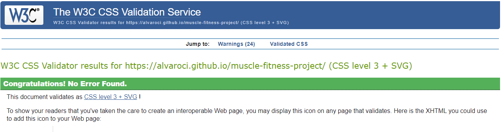

# GYM WEBSITE.

This page is designed for a made-up client, who wants to have a position on the web, making his company known, in this case his gym business.
The main objective of the web is to first have a site on the web, two so that potential clients can see the type of services it offers, its company philosophy, who they are, what they do and what target audience they target. .

Through the different sections we can access the sections of the web:

On the first page, we have a couple of images that show us the type of activities carried out by the company, as well as a brief summary of who they are and what they do.

On the second page our services (I would have liked to have had a little more time, but my full-time job has not allowed me), the idea is to make known to customers the services offered and that are practiced in the company (nutrition, weight lifting, running, etc)

On the third page, join us, the client can, if he wishes, contact the company, to receive more information and to request a service.

The fourth page is a page to show the different memberships as well as their price, so that the client gets the idea of ​​what type of company we are, and the prices we have.

On the fifth and last page, the client can learn more about the history of the company, in case he wants to continue learning more about the fictitious muscle & fitness company.
one line added

# MUSCLE AND FITNESS - GYM WEBSITE.

## User Experience (UX)

### User stories

#### First Time Visitor Goals:

-   As a First Time Visitor, I want to easily understand the main purpose of the organization and learn more about it.
-   As a First Time Visitor, I want to be able to easily navigate throughout the site to find content.
-   As a First Time Visitor, I want to look for information about what they do, and what services they offer

#### Returning Visitor Goals

-   As a Returning Visitor, I want to find new updates and information about the organization.
-   As a Returning Visitor, I want to find the best way to get in contact with the organisation with any questions related to their services or my membership
-   As a Returning Visitor, I want to find easily new content or new services the may be offering.

#### Frequent User Goals

-   As a Frequent User, I want to check to see if there are any newly added content or updates about services or related to the gym situation
-   As a Frequent User, I want to check to see if there are any new media content about what they do.
-   As a Frequent User, I want to be able to find a easy way to get in contact with the organization.

## Design

### Colour Scheme

The three main colours used are Grey, Black and white.

## Typography

The Arial and Monserrat font is the main font used throughout the whole website.

## Imagery

Imagery is important. The large, and background hero images are designed to be striking and catch the user's attention. It also has a modern, energetic aesthetic.

<!-- Wireframes

        Home Page Wireframe - View

        Mobile Wireframe - View

        Contact Us Page Wireframe - View -->

## Features

-   Responsive on all device sizes
-   Interactive elements
-   Easy to Navigate
-   Simple

## Technologies Used

**Languages Used**

-   HTML5
-   CSS3

**Frameworks, Libraries & Programs Used**

-   Bootstrap 4.4.1:
    Bootstrap was used to assist with the responsiveness and styling of the website.
-   Google Fonts:
    Google fonts were used to import the 'Titillium Web' font into the style.css file which is used on all pages throughout the project.
-   Git
    Git was used for version control by utilizing the Gitpod terminal to commit to Git and Push to GitHub.
-   GitHub:
    GitHub is used to store the projects code after being pushed from Git.
-   Balsamiq:
    Balsamiq was used to create the wireframes during the design process.

## Testing

The W3C Markup Validator and W3C CSS Validator Services were used to validate every page of the project to ensure there were no syntax errors in the project.

-   **W3C Markup Validator**
    

-   **W3C CSS Validator**
    

Testing User Stories from User Experience (UX) Section

First Time Visitor Goals

    As a First Time Visitor, I want to easily understand the main purpose of the organization and learn more about it.
        Upon entering the site, users are automatically greeted with a clean and easily readable navigation bar to go to the page of their choice.

    As a First Time Visitor, I want to be able to easily be able to navigate throughout the site to find content.
        The site has been designed to be fluid and never to entrap the user. At the side of each page there is a clean navigation bar, each link describes what the page they will end up at clearly.

On the Join Us Page, you can cleary contact with the organization for any querie.

    As a First Time Visitor, I want to look for information about what they do, and what services they offer
        Once the new visitor has read the About Us, they will be able to understand the born and main concept of the organization.

Also in the Services page, he will be able to see what the organization offer.
They can contact trough the join us page with the organization for any other further info they may need.

Returning Visitor Goals

    As a Returning Visitor, I want to find the new programming challenges or hackathons.
        These are clearly shown in the banner message.
        They will be directed to a page with another hero image and call to action.

    As a Returning Visitor, I want to find the best way to get in contact with the organisation with any questions I may have.
        The navigation bar clearly highlights the "Contact Us" Page.
        Here they can fill out the form on the page or are told that alternatively they can message the organisation on social media.
        The footer contains links to the organisations Facebook, Twitter and Instagram page as well as the organization's email.
        Whichever link they click, it will be open up in a new tab to ensure the user can easily get back to the website.
        The email button is set up to automatically open up your email app and autofill there email address in the "To" section.

    As a Returning Visitor, I want to find the Facebook Group link so that I can join and interact with others in the community.
        The Facebook Page can be found at the footer of every page and will open a new tab for the user and more information can be found on the Facebook page.
        Alternatively, the user can scroll to the bottom of the Home page to find the Facebook Group redirect card and can easily join by clicking the "Join Now!" button which like any external link, will open in a new tab to ensure they can get back to the website easily.
        If the user is on the "Our Favourites" page they will also be greeted with a call to action button to invite the user to the Facebook group. The user is incentivized as they are told there is a weekly favourite product posted in the group.

Frequent User Goals

        As a Frequent User, I want to check to see if there are any newly added challenges or hackathons.
            The user would already be comfortable with the website layout and can easily click the banner message.

        As a Frequent User, I want to check to see if there are any new blog posts.
            The user would already be comfortable with the website layout and can easily click the blog link

        As a Frequent User, I want to sign up to the Newsletter so that I am emailed any major updates and/or changes to the website or organisation.
            At the bottom of every page their is a footer which content is consistent throughout all pages.
            To the right hand side of the footer the user can see "Subscribe to our Newsletter" and are prompted to Enter their email address.
            There is a "Submit" button to the right hand side of the input field which is located close to the field and can easily be distinguished.

Further Testing

    The Website was tested on Google Chrome, Internet Explorer, Microsoft Edge and Safari browsers.
    The website was viewed on a variety of devices such as Desktop, Laptop, iPhone7, iPhone 8 & iPhoneX.
    A large amount of testing was done to ensure that all pages were linking correctly.
    Friends and family members were asked to review the site and documentation to point out any bugs and/or user experience issues.

Known Bugs

    On some mobile devices the Hero Image pushes the size of screen out more than any of the other content on the page.
        A white gap can be seen to the right of the footer and navigation bar as a result.
    On Microsoft Edge and Internet Explorer Browsers, all links in Navbar are pushed upwards when hovering over them.

Deployment
GitHub Pages

The project was deployed to GitHub Pages using the following steps...

    Log in to GitHub and locate the GitHub Repository
    At the top of the Repository (not top of page), locate the "Settings" Button on the menu.
        Alternatively Click Here for a GIF demonstrating the process starting from Step 2.
    Scroll down the Settings page until you locate the "GitHub Pages" Section.
    Under "Source", click the dropdown called "None" and select "Master Branch".
    The page will automatically refresh.
    Scroll back down through the page to locate the now published site link in the "GitHub Pages" section.

Forking the GitHub Repository

By forking the GitHub Repository we make a copy of the original repository on our GitHub account to view and/or make changes without affecting the original repository by using the following steps...

    Log in to GitHub and locate the GitHub Repository
    At the top of the Repository (not top of page) just above the "Settings" Button on the menu, locate the "Fork" Button.
    You should now have a copy of the original repository in your GitHub account.

Making a Local Clone

    Log in to GitHub and locate the GitHub Repository
    Under the repository name, click "Clone or download".
    To clone the repository using HTTPS, under "Clone with HTTPS", copy the link.
    Open Git Bash
    Change the current working directory to the location where you want the cloned directory to be made.
    Type git clone, and then paste the URL you copied in Step 3.

$ git clone https://github.com/YOUR-USERNAME/YOUR-REPOSITORY

    Press Enter. Your local clone will be created.

$ git clone https://github.com/YOUR-USERNAME/YOUR-REPOSITORY

> Cloning into `CI-Clone`...
> remote: Counting objects: 10, done.
> remote: Compressing objects: 100% (8/8), done.
> remove: Total 10 (delta 1), reused 10 (delta 1)
> Unpacking objects: 100% (10/10), done.

Click Here to retrieve pictures for some of the buttons and more detailed explanations of the above process.
Credits
Code

The full-screen hero image code came from this StackOverflow post

    Bootstrap4: Bootstrap Library used throughout the project mainly to make site responsive using the Bootstrap Grid System.

    MDN Web Docs : For Pattern Validation code. Code was modified to better fit my needs and to match an Irish phone number layout to ensure correct validation. Tutorial Found Here

Content

    All content was written by the developer.
